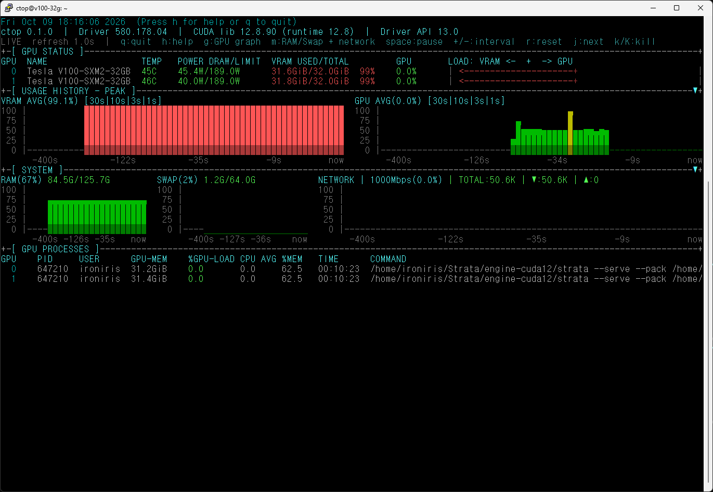

# ctop

NVIDIA GPU, 시스템 메모리, 프로세스, 네트워크 사용량을 터미널에서 확인하는 가벼운 모니터링 도구입니다.

C11 기반 단일 C 프로그램이며 curses 라이브러리를 사용하지 않습니다. GPU 정보는 NVML을 통해 가져오고, 시스템 정보는 Linux의 `/proc` 인터페이스에서 읽습니다.

[English README](README.en.md)



## 주요 기능

- GPU 온도, 전력, VRAM, GPU 사용률 표시
- GPU를 사용하는 프로세스 목록과 GPU Load 표시
- RAM/SWAP 사용량 및 히스토리 그래프
- VRAM/GPU 사용률 히스토리 그래프
- 네트워크 처리량을 bit/s 단위로 표시
- 인터페이스별 실제 링크 속도를 기준으로 네트워크 사용률 계산
- RX/TX 방향 표시 및 인터페이스별 네트워크 정보
- Docker 관련 인터페이스(`docker*`, `br-*`, `veth*`) 제외
- 마우스로 섹션 접기/펼치기
- 선택 가능한 alternate-screen 모드

## 필요한 환경

### 컴파일 시

- Linux
- C11을 지원하는 GCC
- CUDA/NVML 개발 파일
  - `nvml.h`
  - 일반적으로 CUDA의 `targets/x86_64-linux/lib/stubs` 아래에 있는 NVML stub 라이브러리
- 기본 glibc, `libdl`, `libm`

빌드 스크립트의 기본 CUDA 경로는 다음과 같습니다.

```text
/usr/local/cuda-12.8
```

CUDA 설치 경로가 다르면 `CUDA_ROOT` 환경 변수로 지정할 수 있습니다.

### 실행 시

- 지원되는 NVIDIA GPU
- NVML을 제공하는 NVIDIA 드라이버
- `nvidia-smi`가 정상적으로 실행되는 환경
- Linux의 실제 터미널(TTY)
- 최소 터미널 크기 76열 x 13행

다음 `/proc` 및 `/sys` 파일을 사용합니다.

```text
/proc/meminfo
/proc/net/dev
/proc/stat
/proc/uptime
/sys/class/net/<interface>/speed
```

## 사전 설치

Ubuntu/Debian 계열에서 기본 빌드 도구를 설치합니다.

```bash
sudo apt update
sudo apt install build-essential
```

NVIDIA GPU에 맞는 드라이버를 설치한 뒤 확인합니다.

```bash
nvidia-smi
```

이후 NVIDIA 공식 CUDA 설치 안내에 따라 CUDA Toolkit을 설치합니다. CUDA Toolkit에는 `nvml.h`와 NVML stub 라이브러리가 포함되어 있어야 합니다.

CUDA 경로가 `/usr/local/cuda-12.8`이 아닌 경우 설치 경로를 확인합니다.

```bash
find /usr/local -name nvml.h 2>/dev/null
```

## 컴파일

프로젝트 디렉터리에서 실행합니다.

```bash
./build-ctop.sh
```

CUDA가 다른 경로에 설치되어 있다면:

```bash
CUDA_ROOT=/usr/local/cuda ./build-ctop.sh
```

정상적으로 완료되면 프로젝트 디렉터리에 `ctop` 실행 파일이 생성됩니다.

## 실행

```bash
./ctop
```

주요 옵션:

```text
-i, --interval N          갱신 주기(초)
--no-color                ANSI 색상 끄기
--debug-log FILE          디버그 로그 파일
-a, --alternate-screen    종료 시 기존 화면 복원
-r, --restore-screen      --alternate-screen 별칭
-v, --version             버전 표시
```

예시:

```bash
./ctop -i 1
./ctop --no-color
./ctop --alternate-screen
```

## 키 조작

```text
q                         종료
h                         도움말 표시/숨김
g                         GPU 히스토리 접기/펼치기
m                         SYSTEM 섹션 접기/펼치기
Space                     일시정지/재개
+ / -                     갱신 주기 변경
r                         그래프 히스토리 초기화
j                         다음 GPU 프로세스 선택
k / K                     선택한 프로세스 종료 확인
```

터미널이 SGR 마우스 입력을 지원하면 상단의 조작 항목을 클릭할 수도 있습니다.

## 네트워크 표시 방식

네트워크 카운터의 byte 차이를 bit로 변환하여 표시합니다.

```text
NETWORK | <링크속도>(사용률) | TOTAL:처리량 | ▼:수신 | ▲:송신
```

`/sys/class/net/<interface>/speed`에서 인터페이스별 링크 속도를 읽어 사용률을 계산합니다. 속도를 읽을 수 없는 인터페이스는 사용률을 `N/A`로 표시합니다. Docker 컨테이너가 외부로 통신하는 경우에도 호스트의 물리 NIC를 통과한 트래픽은 호스트 전체 사용량으로 집계됩니다. 단, 컨테이너별 사용량을 따로 구분하지는 않습니다.

## 주의사항

- NVML이 초기화되지 않으면 프로그램이 실행되지 않습니다.
- CUDA Toolkit 전체가 아니라도 `nvml.h`와 NVML stub 라이브러리는 컴파일에 필요합니다.
- NVIDIA 드라이버와 NVML 런타임은 실행 시 필요합니다.
- 네트워크 링크 속도를 읽을 수 없는 인터페이스는 사용률을 계산할 수 없습니다.
